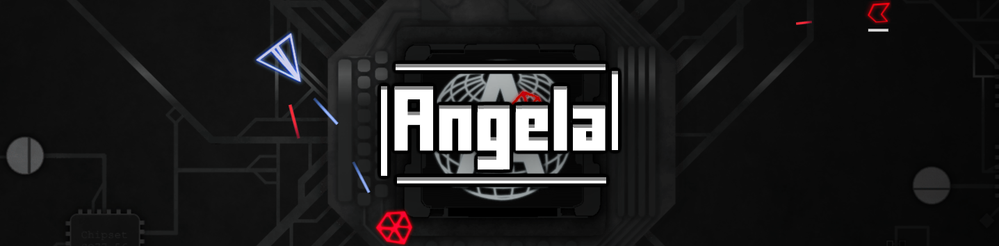

# Angela

**_Warning: This game is dark and not suitable for children or those who are easily disturbed. Contains jumpscares and flashy effects. Player caution advised!_**
_(Also: spaghetti code - extra spOoOoky)_

### Hi and welcome to my little game project!

This simple game is about working with a lovely soul named Angela. The hostiles seem like a threat at a first glance, but is it really them who are evil? Will you seek a revenge or justice?

### Project details

Written in: plain JavaScript

Platform: PC Browser (IE not welcome)

Genre: Action/Horror

Development software: VS Code, Blender, Paint.net, sfxr, Audacity

Spritesheet creator: https://www.codeandweb.com/free-sprite-sheet-packer

Sprite compressor: https://compresspng.com/

Music compressor: https://www.compresss.com/ (quality set to 50)

Music by: Kevin MacLeod (https://incompetech.com/)
Licensed under Creative Commons: By Attribution 3.0
http://creativecommons.org/licenses/by/3.0/
Used music titles:
_title (level number)_
Limit 70 (level 1)
Rising tide (faster) (level 2)
I can feel it coming (level 3)
Hiding your reality (level 4)
Shadowlands 2 - Bridge (final boss fight)
Darkling (final boss fight)
Grim Idol (final battle)
